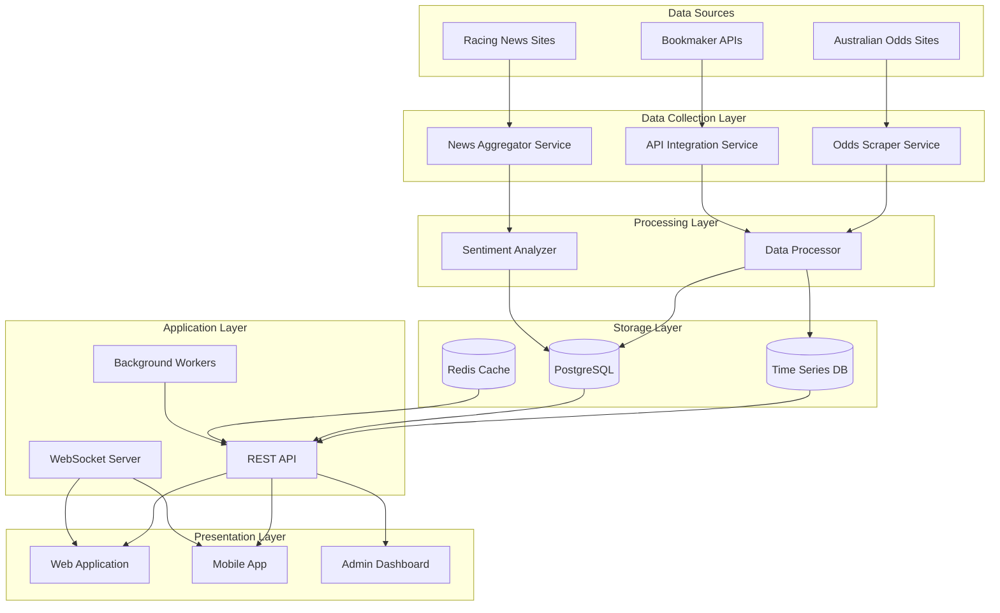

# Design Document

## Overview

The horse racing platform is a multi-component system consisting of:

1. **Data Collection Layer** - Scrapes odds and news from Australian sources
2. **Analysis Engine** - Performs sentiment analysis on racing news
3. **Public Platform** - Odds comparison website with ambassador content
4. **Admin Dashboard** - Management tools for ambassadors, content, and analytics

The system prioritizes real-time data processing, scalability, and user experience while maintaining reliable affiliate tracking for revenue generation.

## Architecture

### High-Level Architecture



### Technology Stack

**Backend:**

- **Runtime**: Node.js with TypeScript for type safety and developer experience
- **API Framework**: Express.js with REST endpoints
- **WebSocket**: Socket.io for real-time odds updates
- **Task Queue**: Bull (Redis-based) for background job processing
- **Web Scraping**: Puppeteer for dynamic content, Cheerio for static HTML parsing
- **AI/ML**: OpenAI API for sentiment analysis and content rewriting

**Data Storage:**

- **Primary Database**: PostgreSQL for relational data (users, ambassadors, articles, bookmakers)
- **Time Series**: TimescaleDB (PostgreSQL extension) for odds history and analytics
- **Cache**: Redis for real-time odds, session management, and rate limiting
- **Object Storage**: AWS S3 or Cloudflare R2 for images and media

**Frontend:**

- **Framework**: Next.js 14 with App Router for SEO and performance
- **UI Library**: React with TypeScript
- **Styling**: Tailwind CSS for rapid development
- **State Management**: React Query for server state, Zustand for client state
- **Charts**: Recharts for odds visualization

**Infrastructure:**

- **Hosting**: Vercel for frontend, Railway/Render for backend services
- **CDN**: Cloudflare for static assets and DDoS protection
- **Monitoring**: Sentry for error tracking, Grafana for metrics
- **Notifications**: Firebase Cloud Messaging for push notifications

## Components and Interfaces

### 1. Odds Collection Service

**Responsibility**: Collect odds data from bookmaker APIs with web scraping as fallback.

**Key Features:**

- Primary: Direct bookmaker API integration
- Fallback: Web scraping for bookmakers without API access
- Data normalization across different API formats
- Real-time odds updates via webhooks where available
- Health monitoring and alerting

**Interface:**

```typescript
interface OddsCollectionService {
  fetchOddsFromAPI(bookmaker: string, raceId?: string): Promise<RaceOdds[]>;
  scrapeOddsAsFallback(source: ScraperSource): Promise<RaceOdds[]>;
  scheduleOddsUpdate(bookmaker: string, interval: number): void;
  getSourceHealth(source: string): HealthStatus;
}

interface BookmakerAPIConfig {
  id: string;
  name: string;
  apiEndpoint: string;
  authType: 'api_key' | 'oauth' | 'basic';
  credentials: ApiCredentials;
  rateLimits: RateLimitConfig;
  webhookSupport: boolean;
}

interface ScraperSource {
  id: string;
  name: string;
  url: string;
  market: 'AU';
  selectors: ScraperSelectors;
  usedWhenAPIFails: boolean;
}

interface RaceOdds {
  sourceId: string;
  sourceName: string;
  sourceType: 'api' | 'scraper';
  market: 'AU';
  raceId: string;
  raceName: string;
  meetingLocation: string;
  startTime: Date;
  selections: Selection[];
  fetchedAt: Date;
}

interface Selection {
  horseName: string;
  horseNumber: number;
  bookmaker: string;
  winOdds: number;
  placeOdds?: number;
  eachWayTerms?: EachWayTerms;
  lastUpdated: Date;
}

interface EachWayTerms {
  places: number;
  fraction: string; // e.g., "1/4", "1/5"
}
```

**Implementation Notes:**

- Prioritize bookmaker APIs: TAB, Sportsbet, Ladbrokes, Neds, Bet365, Unibet
- Use OAuth 2.0 for authentication where required
- Implement webhook listeners for real-time odds updates
- Store API responses for debugging and audit trail
- Use web scraping only as fallback when API unavailable or rate-limited
- Implement circuit breaker pattern for both API and scraping failures

### 2. News Aggregator Service

**Responsibility**: Collect racing news from multiple Australian sources and prepare for sentiment analysis.

**Key Features:**

- RSS feed monitoring and web scraping
- Duplicate detection using content hashing
- Entity extraction (horses, jockeys, trainers)
- Article categorization and tagging
- Scheduled polling with configurable intervals

**Interface:**

```typescript
interface NewsAggregator {
  aggregateNews(sources: NewsSource[]): Promise<NewsArticle[]>;
  extractEntities(article: NewsArticle): EntityMentions;
  detectDuplicates(articles: NewsArticle[]): NewsArticle[];
}

interface NewsSource {
  id: string;
  name: string;
  url: string;
  type: 'rss' | 'web';
  selectors?: ScraperSelectors;
  pollInterval: number; // minutes
}

interface NewsArticle {
  id: string;
  sourceId: string;
  title: string;
  content: string;
  author?: string;
  publishedAt: Date;
  url: string;
  entities: EntityMentions;
  sentiment?: SentimentScore;
  rewrittenContent?: string;
}

interface EntityMentions {
  horses: string[];
  jockeys: string[];
  trainers: string[];
  meetings: string[];
}
```

### 3. Sentiment Analyzer

**Responsibility**: Process news articles to extract sentiment and generate AI-rewritten summaries.

**Key Features:**

- Sentiment classification (positive, negative, neutral)
- Entity-specific sentiment scoring
- AI-powered content rewriting for clarity
- Key insight extraction
- Batch processing for efficiency

**Interface:**

```typescript
interface SentimentAnalyzer {
  analyzeSentiment(article: NewsArticle): Promise<SentimentScore>;
  rewriteContent(article: NewsArticle): Promise<string>;
  extractInsights(article: NewsArticle): Promise<string[]>;
}

interface SentimentScore {
  overall: 'positive' | 'negative' | 'neutral';
  confidence: number; // 0-1
  entitySentiments: Map<string, EntitySentiment>;
}

interface EntitySentiment {
  entityName: string;
  entityType: 'horse' | 'jockey' | 'trainer';
  sentiment: 'positive' | 'negative' | 'neutral';
  confidence: number;
  relevantQuotes: string[];
}
```

**Implementation Notes:**

- Use OpenAI GPT-4 for sentiment analysis and rewriting
- Implement prompt engineering for consistent entity extraction
- Cache results to avoid redundant API calls
- Batch multiple articles in single API call when possible

### 4. Odds Comparison Platform (Frontend)

**Responsibility**: Public-facing website for odds comparison, news, and ambassador content.

**Key Features:**

- Real-time odds display with WebSocket updates
- Race filtering and search
- Bookmaker comparison with affiliate links
- Ambassador article browsing
- User watchlists and personalization
- Mobile-responsive design

**Page Structure:**

```
/                          - Homepage with featured races and articles
/races                     - All upcoming races with filters
/races/[raceId]           - Individual race odds comparison
/news                      - News feed with sentiment indicators
/news/[articleId]         - Individual article view
/ambassadors              - Ambassador directory
/ambassadors/[slug]       - Ambassador profile and articles
/bookmakers               - Bookmaker comparison and reviews
/bookmakers/[slug]        - Individual bookmaker details
/account                  - User account and watchlist management
```

**Key Components:**

```typescript
// Race odds table with real-time updates
<OddsTable
  raceId={string}
  bookmakers={Bookmaker[]}
  onBookmakerClick={(bookmaker, selection) => trackAffiliate()}
/>

// News feed with sentiment
<NewsFeed
  articles={NewsArticle[]}
  filters={NewsFilters}
  watchlist={string[]}
/>

// Ambassador article
<AmbassadorArticle
  article={Article}
  author={Ambassador}
  relatedRaces={Race[]}
/>
```

### 5. Admin Dashboard

**Responsibility**: Management interface for platform administrators and ambassadors.

**Key Features:**

- Ambassador management and approval
- Content moderation workflow
- Analytics and reporting
- Scraper health monitoring
- Affiliate tracking and commission calculation

**Interface Sections:**

```
/admin/dashboard          - Overview metrics and alerts
/admin/ambassadors        - Ambassador management
/admin/content            - Content moderation queue
/admin/scrapers           - Scraper health and configuration
/admin/affiliates         - Revenue tracking and reports
/admin/users              - User management
```

### 6. Bookmaker API Integration Service

**Responsibility**: Manage connections to bookmaker APIs for odds feeds, affiliate tracking, and conversion monitoring.

**Key Features:**

- Multi-bookmaker API client with unified interface
- Secure authentication and credential management
- Rate limiting and quota management per API
- Webhook handling for real-time updates
- Conversion tracking via API callbacks
- Automatic retry with exponential backoff

**Interface:**

```typescript
interface BookmakerAPIService {
  // Odds retrieval
  fetchAllRaces(bookmaker: string): Promise<BookmakerOdds[]>;
  fetchRaceOdds(bookmaker: string, raceId: string): Promise<BookmakerOdds>;
  subscribeToOddsUpdates(bookmaker: string, raceId: string, callback: Function): void;

  // Affiliate tracking
  generateAffiliateLink(bookmaker: string, raceId?: string, userId?: string): string;
  trackConversion(bookmaker: string, referralId: string): Promise<void>;

  // Health and monitoring
  getApiHealth(bookmaker: string): HealthStatus;
  getApiQuotaRemaining(bookmaker: string): QuotaInfo;
}

interface BookmakerOdds {
  bookmaker: string;
  bookmakerId: string;
  raceId: string;
  raceName: string;
  meetingLocation: string;
  startTime: Date;
  selections: Selection[];
  fetchedAt: Date;
  source: 'api';
  apiVersion: string;
}

interface QuotaInfo {
  remaining: number;
  limit: number;
  resetAt: Date;
}
```

**Supported Bookmaker APIs:**

- **TAB** - Australia's largest tote operator
- **Sportsbet** - Major Australian bookmaker
- **Ladbrokes** - International bookmaker with AU presence
- **Neds** - Popular Australian betting platform
- **Bet365** - Global bookmaker with comprehensive API
- **Unibet** - European bookmaker with AU operations
- **Pointsbet** - Australian-founded bookmaker
- **BlueBet** - Growing Australian bookmaker

**Implementation Notes:**

- Use environment variables for API credentials
- Implement token refresh for OAuth-based APIs
- Cache API responses to minimize quota usage
- Log all API calls for debugging and compliance
- Handle different odds formats (decimal, fractional)
- Normalize race and horse names across different APIs

## Data Models

### Core Entities

```typescript
// Race and odds data
interface Race {
  id: string;
  meetingLocation: string;
  meetingDate: Date;
  raceNumber: number;
  raceName: string;
  distance: number;
  trackCondition: string;
  startTime: Date;
  status: 'upcoming' | 'live' | 'resulted';
}

interface Horse {
  id: string;
  name: string;
  age: number;
  sex: string;
  trainer: string;
  jockey: string;
  form: string;
  weight: number;
}

interface OddsSnapshot {
  id: string;
  raceId: string;
  horseId: string;
  bookmaker: string;
  market: 'AU';
  winOdds: number;
  placeOdds?: number;
  timestamp: Date;
}

// User and personalization
interface User {
  id: string;
  email: string;
  name: string;
  createdAt: Date;
  preferences: UserPreferences;
  watchlist: Watchlist;
  subscriptionTier: 'free' | 'premium';
}

interface Watchlist {
  horses: string[];
  jockeys: string[];
  trainers: string[];
  meetings: string[];
}

interface UserPreferences {
  notifications: {
    news: boolean;
    watchlist: boolean;
  };
  emailDigest: {
    enabled: boolean;
    time: string; // HH:mm format
  };
}

// Ambassador and content
interface Ambassador {
  id: string;
  name: string;
  slug: string;
  bio: string;
  profileImage: string;
  socialLinks: SocialLinks;
  commissionRate: number;
  status: 'pending' | 'active' | 'suspended';
  joinedAt: Date;
}

interface Article {
  id: string;
  ambassadorId: string;
  title: string;
  slug: string;
  content: string;
  excerpt: string;
  featuredImage?: string;
  status: 'draft' | 'pending' | 'published';
  publishedAt?: Date;
  tags: string[];
  relatedRaces: string[];
  views: number;
  clicks: number;
}

// Affiliate tracking
interface Referral {
  id: string;
  userId?: string;
  ambassadorId?: string;
  bookmaker: string;
  raceId?: string;
  articleId?: string;
  clickedAt: Date;
  convertedAt?: Date;
  commission?: number;
  ipAddress: string;
  userAgent: string;
}

interface Bookmaker {
  id: string;
  name: string;
  slug: string;
  logo: string;
  affiliateLink: string;
  features: string[];
  rating: number;
  currentPromotions: Promotion[];
  apiEnabled: boolean;
}
```

### Database Schema Design

**PostgreSQL Tables:**

- `races` - Race information
- `horses` - Horse details
- `users` - User accounts
- `ambassadors` - Ambassador profiles
- `articles` - Ambassador content
- `bookmakers` - Bookmaker information
- `referrals` - Affiliate tracking
- `news_articles` - Aggregated news
- `watchlists` - User watchlist items

**TimescaleDB Hypertables:**

- `odds_snapshots` - Time-series odds data (partitioned by timestamp)
- `scraper_metrics` - Scraper performance metrics

**Redis Keys:**

- `odds:race:{raceId}` - Current odds for race (TTL: 5 minutes)
- `ratelimit:scraper:{source}` - Rate limiting counters
- `session:{userId}` - User session data

## Error Handling

### Scraping Failures

**Strategy**: Graceful degradation with fallback mechanisms

1. **Primary Failure**: If main scraper fails, try backup selectors
2. **Source Unavailable**: Switch to alternative data source
3. **Rate Limited**: Implement exponential backoff and proxy rotation
4. **Data Quality Issues**: Validate scraped data, discard invalid records
5. **Persistent Failures**: Alert administrators, mark source as degraded

```typescript
class ScraperErrorHandler {
  async handleScraperError(error: ScraperError, source: ScraperSource): Promise<void> {
    if (error.type === 'RATE_LIMITED') {
      await this.backoffAndRetry(source);
    } else if (error.type === 'SELECTOR_FAILED') {
      await this.tryBackupSelectors(source);
    } else if (error.type === 'SOURCE_UNAVAILABLE') {
      await this.switchToFallbackSource(source);
      await this.alertAdministrators(source, error);
    }

    await this.logError(error, source);
  }
}
```

### API Failures

**Strategy**: Circuit breaker pattern with fallback to scraping

```typescript
class ApiCircuitBreaker {
  private failureCount: Map<string, number> = new Map();
  private readonly threshold = 5;
  private readonly resetTimeout = 60000; // 1 minute

  async callApi(bookmaker: string, operation: () => Promise<any>): Promise<any> {
    if (this.isOpen(bookmaker)) {
      throw new Error('Circuit breaker open, using fallback');
    }

    try {
      const result = await operation();
      this.onSuccess(bookmaker);
      return result;
    } catch (error) {
      this.onFailure(bookmaker);
      throw error;
    }
  }
}
```

### User-Facing Errors

**Strategy**: Clear messaging with actionable guidance

- **Odds Unavailable**: "Odds temporarily unavailable. Refreshing..."
- **Search No Results**: "No races found. Try adjusting your filters."
- **Article Load Failed**: "Article unavailable. Please try again later."

## Testing Strategy

### Unit Testing

**Coverage**: Individual functions and components

- Odds parsing and normalization logic
- Sentiment analysis prompt engineering
- Data validation functions
- Utility functions

**Tools**: Jest, React Testing Library

### Integration Testing

**Coverage**: Component interactions and data flow

- Scraper → Database → API flow
- API → Frontend data rendering
- WebSocket real-time updates
- Affiliate link tracking
- Email notification delivery

**Tools**: Jest, Supertest, Playwright

### End-to-End Testing

**Coverage**: Critical user journeys

1. User views race odds → clicks bookmaker → referral tracked
2. Ambassador publishes article → appears on site → generates referrals
3. News aggregated → sentiment analyzed → displayed in feed
4. User creates watchlist → receives personalized news

**Tools**: Playwright, Cypress

### Performance Testing

**Coverage**: System scalability and response times

- Concurrent scraping of 50+ sources
- API response time under load (1000 req/s)
- WebSocket connection handling (10,000 concurrent)
- Database query performance with 1M+ odds records
- Frontend load time on 3G connection

**Tools**: k6, Lighthouse

### Monitoring and Observability

**Metrics to Track:**

- Scraper success rate by source
- API response times (p50, p95, p99)
- WebSocket connection count
- Database query performance
- Affiliate conversion rate
- User engagement metrics

**Alerting Rules:**

- Scraper failure rate > 20% for 5 minutes
- API response time > 2 seconds for 5 minutes
- Database connection pool exhausted
- WebSocket server down

**Tools**: Grafana, Prometheus, Sentry, Datadog

## Security Considerations

### Data Protection

- Encrypt sensitive data at rest (user emails, API credentials)
- Use HTTPS for all communications
- Implement rate limiting on public APIs
- Sanitize user inputs to prevent XSS/SQL injection

### Authentication & Authorization

- JWT-based authentication for users and ambassadors
- Role-based access control (user, ambassador, admin)
- API key authentication for bookmaker integrations
- Session management with secure cookies

### Scraping Ethics

- Respect robots.txt directives
- Implement reasonable rate limiting
- Use official APIs where available
- Cache data to minimize requests
- Identify scraper with user agent

### Compliance

- GDPR compliance for user data
- Cookie consent for tracking
- Terms of service for affiliate links
- Responsible gambling messaging
- Age verification for betting content

## Deployment Strategy

### Phase 1: MVP (Months 1-2)

- Bookmaker API integrations (3-5 major bookmakers)
- Basic odds comparison website
- Admin dashboard for monitoring
- Basic affiliate tracking
- Web scraping fallback for non-API bookmakers

### Phase 2: Content Platform (Months 3-4)

- News aggregation and sentiment analysis
- Ambassador content management
- Enhanced odds comparison features
- Mobile responsive design
- Additional bookmaker API integrations

### Phase 3: Scale & Optimize (Months 5-6)

- Real-time WebSocket updates with API webhooks
- Advanced analytics and reporting
- Mobile app development
- Performance optimization
- Complete bookmaker API coverage

### Infrastructure Scaling

- Start with single server deployment
- Add Redis caching as traffic grows
- Implement CDN for static assets
- Scale scrapers horizontally with worker pools
- Database read replicas for analytics queries

## Advanced Features & Considerations

### Data Quality & Validation

**Odds Validation:**

```typescript
interface OddsValidator {
  validateOdds(odds: RaceOdds): ValidationResult;
  detectAnomalies(odds: RaceOdds, historical: OddsSnapshot[]): Anomaly[];
}

interface ValidationResult {
  valid: boolean;
  errors: ValidationError[];
  warnings: ValidationWarning[];
}

// Validation rules:
// - Odds must be >= 1.01
// - Sum of implied probabilities should be > 100% (bookmaker margin)
// - Sudden odds changes > 50% flagged for review
```

**Data Reconciliation:**

- Compare odds across multiple sources for same race
- Flag discrepancies for manual review
- Build confidence scores for each data source
- Maintain data lineage for debugging

### Caching Strategy

**Multi-Level Caching:**

1. **Browser Cache** (Service Worker)
   - Static assets (CSS, JS, images)
   - Race metadata (meeting info, horse details)
   - TTL: 24 hours

2. **CDN Cache** (Cloudflare)
   - API responses for historical data
   - Ambassador articles and images
   - TTL: 1 hour, purge on update

3. **Application Cache** (Redis)
   - Current odds (TTL: 2 minutes)
   - User sessions (TTL: 24 hours)
   - Rate limiting counters (TTL: 1 minute)

4. **Database Query Cache**
   - Materialized views for analytics
   - Refresh every 15 minutes
   - Pre-computed aggregations

**Cache Invalidation:**

```typescript
class CacheManager {
  async invalidateRaceOdds(raceId: string): Promise<void> {
    await redis.del(`odds:race:${raceId}`);
    await this.notifyWebSocketClients(raceId);
  }
}
```

### WebSocket Real-Time Updates

**Connection Management:**

```typescript
interface WebSocketServer {
  // Client subscribes to specific races
  subscribeToRace(clientId: string, raceId: string): void;

  // Broadcast odds update to subscribed clients
  broadcastOddsUpdate(raceId: string, odds: RaceOdds): void;
}

// Message format
interface WebSocketMessage {
  type: 'odds_update' | 'race_status' | 'news_update';
  payload: any;
  timestamp: Date;
}
```

**Scalability:**

- Use Redis pub/sub for multi-server WebSocket coordination
- Implement connection pooling and heartbeat monitoring
- Graceful degradation to polling if WebSocket unavailable
- Limit subscriptions per client to prevent abuse

### SEO Optimization

**Technical SEO:**

- Server-side rendering with Next.js for all public pages
- Dynamic sitemap generation for races and articles
- Structured data (Schema.org) for races, articles, and reviews
- Open Graph tags for social sharing
- Canonical URLs to prevent duplicate content

**Content Strategy:**

- Race preview pages with unique content
- Ambassador articles optimized for racing keywords
- Bookmaker review pages with comparison tables
- Racing guides and educational content
- Regular blog posts about racing trends

**Example Structured Data:**

```json
{
  "@context": "https://schema.org",
  "@type": "SportsEvent",
  "name": "Melbourne Cup 2025",
  "startDate": "2025-11-04T15:00:00+11:00",
  "location": {
    "@type": "Place",
    "name": "Flemington Racecourse"
  },
  "offers": {
    "@type": "AggregateOffer",
    "lowPrice": "2.50",
    "highPrice": "15.00",
    "priceCurrency": "AUD"
  }
}
```

### Analytics & Business Intelligence

**User Analytics:**

- Track user journey from landing to conversion
- Identify high-performing content and ambassadors
- A/B testing for UI/UX improvements
- Cohort analysis for retention

**Business Metrics:**

- Revenue per user (RPU)
- Customer acquisition cost (CAC)
- Lifetime value (LTV)
- Conversion rate by traffic source
- Ambassador ROI

**Racing Analytics:**

- Most popular races and meetings
- Odds movement patterns
- News sentiment correlation with odds

**Dashboard Queries:**

```sql
-- Top performing ambassadors by referrals
SELECT
  a.name,
  COUNT(r.id) as total_referrals,
  COUNT(r.converted_at) as conversions,
  SUM(r.commission) as total_commission
FROM ambassadors a
LEFT JOIN referrals r ON a.id = r.ambassador_id
WHERE r.clicked_at >= NOW() - INTERVAL '30 days'
GROUP BY a.id
ORDER BY total_commission DESC;
```

### Mobile App Considerations

**Native Features:**

- Push notifications for news alerts
- Biometric authentication
- Offline mode for viewing saved races
- Quick bet slip integration
- Location-based race recommendations

**Technology:**

- React Native for cross-platform development
- Share codebase with web application
- Native modules for performance-critical features
- Deep linking to bookmaker apps

### Compliance & Legal

**Gambling Regulations:**

- Display responsible gambling messages
- Age verification for certain content
- Geo-blocking for restricted jurisdictions
- Affiliate disclosure on all bookmaker links
- Terms and conditions for platform use

**Data Privacy:**

- GDPR compliance (EU users)
- CCPA compliance (California users)
- Cookie consent management
- Data export and deletion requests
- Privacy policy and data handling documentation

**Affiliate Compliance:**

- Transparent commission disclosure
- No misleading claims about odds or winnings
- Clear distinction between editorial and promotional content
- Bookmaker licensing verification

### Cost Optimization

**Infrastructure Costs:**

- Use serverless functions for sporadic tasks
- Auto-scaling for variable load
- Spot instances for non-critical workers
- CDN to reduce bandwidth costs
- Database connection pooling

**API Costs:**

- Cache OpenAI responses aggressively
- Batch sentiment analysis requests
- Use cheaper models for simple tasks
- Monitor and alert on unusual usage

**Scraping Costs:**

- Minimize requests with smart caching
- Use residential proxies only when needed
- Implement request deduplication
- Schedule non-urgent scraping during off-peak

### Future Enhancements

**Phase 4: Advanced Features**

- Live streaming integration for races
- Social features (user comments, tips sharing)
- Advanced statistics and form analysis
- Automated betting via bookmaker APIs

**Phase 5: Expansion**

- Additional sports (greyhounds, harness racing)
- International market expansion (UK market)
- White-label platform for partners
- B2B data API for professional bettors
- Mobile app launch

**Potential Integrations:**

- Racing form providers (Timeform, Racing Post)
- Payment processors for premium subscriptions
- CRM systems for ambassador management
- Marketing automation platforms
- Business intelligence tools

## Technical Debt Management

**Code Quality:**

- Enforce TypeScript strict mode
- Maintain >80% test coverage
- Regular dependency updates
- Code review requirements
- Automated linting and formatting

**Documentation:**

- API documentation with OpenAPI/Swagger
- Component storybook for UI library
- Architecture decision records (ADRs)
- Runbooks for common operations
- Onboarding guide for new developers

**Refactoring Priorities:**

- Extract reusable scraper framework
- Standardize error handling patterns
- Optimize database queries
- Reduce bundle size
- Improve type safety

## Success Metrics

**Technical KPIs:**

- 99.5% uptime during racing hours
- <2s API response time (p95)
- <5% scraper failure rate
- > 90% WebSocket connection success

**Business KPIs:**

- 10,000 monthly active users (Year 1)
- 50 active ambassadors (Year 1)
- $50,000 monthly affiliate revenue (Year 1)
- 5% conversion rate on referrals
- 40% user retention (30-day)

**User Experience KPIs:**

- <3s page load time
- > 4.5 star app rating
- <2% bounce rate on odds pages
- > 5 pages per session
- > 3 minutes average session duration
